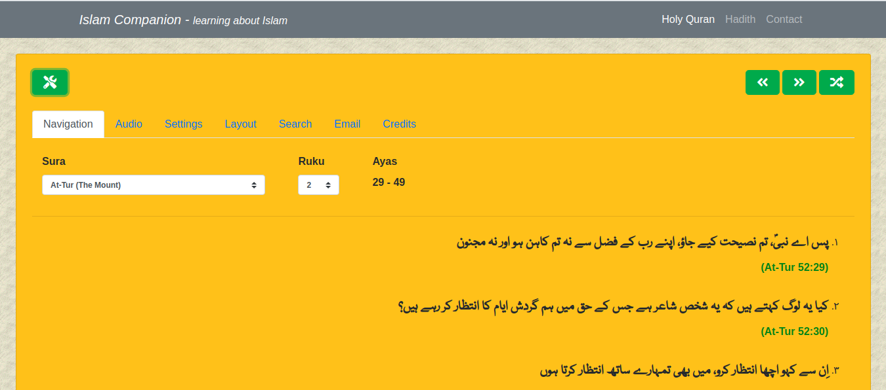

### Introduction
The "**Islam Companion Web API**" project is a RESTFul API (Application Programming Interface) that allows users to add Holy Quran and Hadith data to their applications. It provides Holy Quran translation in 42 languages. Following languages are supported: **Amharic, Arabic, Bosnian, Bengali, Bulgarian, Amazigh, Czech, German, Divehi, Spanish, English, Persian, French, Hindi, Hausa, Indonesian, Italian, Japanese, Korean, Kurdish, Malayalam, Malay, Dutch, Norwegian, Portuguese, Polish, Russian, Romanian, Swedish, Somali, Sindhi, Albanian, Swahili, Turkish, Tajik, Tamil, Tatar, Thai, Uzbek, Urdu, Uyghur and Chinese**. Hadith translation is provided in **Urdu, English and Arabic languages**
An example of a website that uses the Islam Companion Web API is the [Islam Companion website](https://islamcompanion.pakjiddat.pk/). The [Holy Quran Reader](https://islamcompanion.pakjiddat.pk/holy-quran) and [Hadith Reader](https://islamcompanion.pakjiddat.pk/hadith) were developed using the Islam Companion Web API
The goal of the Islam Companion Web API is to help users developed applications that promote knowledge about Islam.

### Features
The Islam Companion Web API has the following features:

* It provides translations of Holy Quran in 42 languages
* It provides translations of Hadith in Urdu, English and Arabic languages
* It provides 8 API functions for fetching Quranic data
* It provides 7 API functions for fetching Hadith data
* The source code is available under [GPL License](https://github.com/nadirlc/islamcompanion-web-api/blob/master/LICENSE)
* The source code is well commented and easy to update

### Requirements
The Islam Companion Web API requires Php >= 7.2. It also requires MySQL server >= 5.6.

### Installation
The following steps can be used to install the "Islam Companion Web API" project on your own server:

* Download the [source code](https://github.com/nadirlc/islamcompanion-web-api/archive/master.zip) from GitHub
* Move the source code to the document root of a virtual host
* Download the contents of the database from: [here](https://islamcompanion.pakjiddat.pk/islamcompanion/data/islamcompanion-website.sql.tar.bz2)
* Extract the downloaded file
* Create a database and import the contents of the sql file to the database. Note down the credentials used for connecting to the database
* Enter the database credentials in the file **api/config/RequiredObjects.php**
* In the file: **api/Config.php**, on **line 37** enter the domain names that will be used to access the api
* Customize the following variables in the file: **api/config/General.php**. **$config['app_name'], $config['dev_mode'] and $config['site_url']**

### Download data
We have compiled a Hadith database with the purpose of spreading knowledge of Hadith. The database should be used by developers in their own applications. The Hadith database contains text in Urdu, English and Arabic languages.

[Click here](https://islamcompanion.pakjiddat.pk/islamcompanion/data/hadith.sql.tar.bz2) to download the Hadith database in **.sql** format for MySQL server. [Click here](https://islamcompanion.pakjiddat.pk/islamcompanion/data/hadith.db.tar.bz2) to download the Hadith database in **.db** format for SQLite server

[Click here](https://islamcompanion.pakjiddat.pk/islamcompanion/data/holy-quran.db.tar.bz2) to download the Quranic database in **.db** format for SQLite server

### Frequently asked questions

* **What is the Islam Companion Web API**. It is a RESTFul API for accessing Holy Quran and Hadith data
* **What can I do with the Islam Companion Web API**. You can develop web based applications that present Holy Quran and Hadith data to the user. The Islam Companion Api can work as the backend of your application.
* **Which languages are supported by the Islam Companion Web API**. [Click Here](#introduction)
* **What functions are provided by the Islam Companion Api**. Please read the documentation.
* **From where does the API get its data**. The Islam Companion API uses Holy Quran translations from [http://tanzil.net/trans/](http://tanzil.net/trans/). It uses Hadith data from [http://hadithcollection.com/](http://hadithcollection.com/) and [https://www.quranurdu.com/Ahadith/](https://www.quranurdu.com/Ahadith/).
* **How do I use the API**. To use the API, you have to make HTTP POST request to the server islamcompanion.pakjiddat.pk. Please see following sample code in Php language.

### Sample Code
**View sample code**

```
&#x3C;?php

$data = array(
    &#x27;language&#x27; =&#x3E; &#x27;English&#x27;,
    &#x27;narrator&#x27; =&#x3E; &#x27;Mohammed Marmaduke William Pickthall&#x27;
);

// Prepare new cURL resource
$ch = curl_init(&#x27;https://islamcompanion.pakjiddat.pk/api/get_random_verses&#x27;);
curl_setopt($ch, CURLOPT_RETURNTRANSFER, true);
curl_setopt($ch, CURLINFO_HEADER_OUT, true);
curl_setopt($ch, CURLOPT_POST, true);
curl_setopt($ch, CURLOPT_POSTFIELDS, $data);

// Submit the POST request
$result = curl_exec($ch);

// Close cURL session handle
curl_close($ch);

// json decode the response
$result = json_decode($result, true);

// Print the result
print_r($result);
?&#x3E;
```

### Usage
The Islam Companion Web API supports the following functions. All function response values are in JSON format.
To test the API, use the following url: [https://islamcompanion.pakjiddat.pk/api/](https://islamcompanion.pakjiddat.pk/api/) for making api requests. All API requests must be of type HTTP POST and should include the required API parameters.

### API calls for fetching Holy Quran data

| Name | Description | Url | Parameters | Response |
| ---- | ----------- | --- | ---------- | -------- |
| Get Suras In Division | Returns the list of suras for the given division and division number | /api/get_suras_in_division | * **division**. The division name. It can be hizb,juz,page,manzil,ruku* **div_num**. The division number. It should be a number 1 and 604 | The names of all the suras that are in the given division:  * **tname**. The english name of the sura* **ename**. A brief description of the sura in English* **sindex**. The sura number. It should be a number 1 and 114 |
| Get Ruku List | It provides the start and end ruku numbers for the given division, division number and sura | /api/get_ruku_list | * **division**. The division name. It can be hizb,juz,page,manzil,ruku* **div_num**. The division number. It should be a number 1 and 604* **sura**. The sura number. It should be a number 1 and 114 | The start and end ruku numbers* **start_ruku**. The start sura ruku number. It should be a number 1 and 40* **end_ruku**. The end sura ruku number. It should be a number 1 and 40 |
| Get Verses | It returns the arabic text and translation for the given verses | /api/get_verses | * **start_ayat**. The start ayat number* **end_ayat**. The end ayat number* **language**. The language for the verse text* **narrator**. The translator name* **sura**. The sura number | The list of required ayas* **arabic_text**. The arabic text* **translation**. The translated text* **sura_id**. The sura id* **sura_name**. The sura name* **ayat**. The ayat number |
| Get Random Verses | It returns the text for a random ruku along with meta data | /api/get_random_verses | * **language**. The language for the verse text* **narrator**. The translator name | The verse data* **arabic**. The verse text in arabic* **translation**. The translated text* **meta_data**. The ruku meta data |
| Get Holy Quran Navigator Configuration | It generates the navigator configuration data for the given action | /api/get_quran_nav_config | * **action**. The action taken by the user* **div_num**. The current division number* **division**. The current division* **sura**. The current sura* **sura_ruku**. The current sura ruku | The updated Navigator configuration data* **sura**. The new sura* **sura_ruku**. The new ruku id* **start_ayat**. The new start ayat* **end_ayat**. The new end ayat* **div_num**. The new division number* **audiofile**. The base audio file name |
| Get Languages | It returns the list of all supported languages | /api/get_languages | None | The list of all supported languages |
| Get Narrators | It returns the list of all supported narrators for the given language | /api/get_narrators | * **language**. The language for the verse text | The list of all supported narrators |
| Search Ayat | It returns list of ayas that contain the given text | /api/search_ayat | * **is_random**. Indicates if random search results should be fetched* **language**. Custom the language for the verse text* **narrator**. The translator name* **page_number**. The search results page number* **results_per_page**. The number of results per page* **search_text**. The search text | Contains the search results and total result count* **search_results**. The verse data that contains the given text* **result_count**. The total number of results |

### API calls for fetching Hadith data

| Name | Description | Url | Parameters | Response |
| ---- | ----------- | --- | ---------- | -------- |
| Get Hadith Books | It returns the list of Hadith books for the given Hadith source | /api/get_hadith_books | * **language**. The hadith language* **source**. The hadith source for which the books need to be fetched | The list of Hadith books* **id**. The hadith book id* **book**. The hadith book |
| Get Hadith Titles | It fetches list of Hadith book titles for the given Hadith book and source | /api/get_hadith_titles | * **book_id**. The hadith book id* **language**. The hadith language | The list of hadith book titles* **id**. The hadith title id* **title**. The hadith title |
| Get Hadith | It fetches list of Hadith text for the given Hadith title and book id | /api/get_hadith | * **language**. The hadith language* **title_id**. The hadith title id | The list of Hadith* **text**. The hadith text* **title**. The hadith title* **title_id**. The hadith title id* **book_id**. The hadith book id* **book**. The hadith book name* **number**. The hadith number* **source**. The hadith source |
| Get Random Hadith | It fetches list of random hadith text | /api/get_random_hadith | * **hadith_count**. The number of hadith to fetch* **language**. The hadith language | The hadith text* **text**. The hadith text* **source**. The hadith source* **book**. The hadith book name* **number**. The hadith number
| Get Hadith Sources | It fetches list of hadith sources for the given language | /api/get_hadith_sources | * **language**. The hadith language | The list of hadith sources* **hadith_sources**. The hadith sources |
| Get Hadith Navigator Configuration | It returns the navigator configuration for given navigator action | /api/get_hadith_nav_config | * **action**. The action taken by the user* **book_id**. The hadith book id* **language**. The hadith language* **source**. The hadith source* **title_id**. The hadith book title id | The updated Navigator configuration data* **source**. The new Hadith source* **book_id**. The new Hadith book id* **title_id**. The new Hadith book title id |
| Search Hadith | It returns list of hadith that contain the given text | /api/search_hadith | * **is_random**. Indicates if random search results should be fetched* **language**. The language for the hadith text* **page_number**. The search results page number* **results_per_page**. The number of results per page* **search_text**. The search text | Contains the search results and total result count* **search_results**. The search results* **result_count**. The total number of results |
